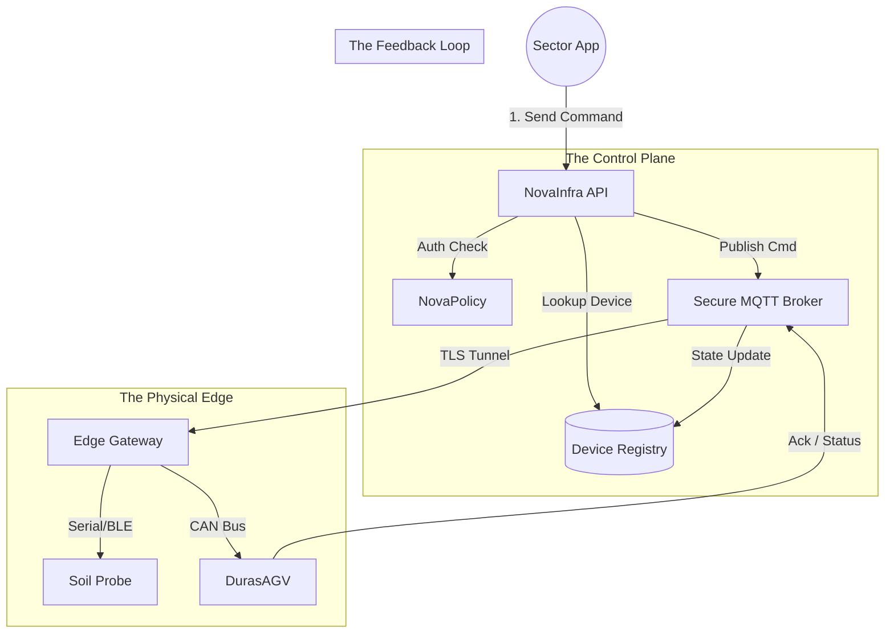

# 📡 NovaInfra

> **The Operating System for Physical Assets.**
> Universal device registry, fleet management command, and secure IoT orchestration for the circular economy.

[](https://www.google.com/search?q=https://github.com/novaeco-tech/novainfra/actions)
[](https://opensource.org/licenses/MIT)
[](https://www.google.com/search?q=https://infrastructure.novaeco.tech)

**NovaInfra** is the Horizontal Enabler responsible for the **Physical Layer**. In a system-of-systems, software needs to talk to hardware. `NovaAgro` needs to steer robots, `NovaEnergy` needs to throttle inverters, and `NovaWater` needs to open valves.

**NovaInfra** abstracts this complexity. It provides a unified API to register, monitor, and command any physical device, handling the low-level messiness of MQTT, LoRaWAN, and cellular connectivity so other sectors don't have to.

-----

## 🎯 Value Proposition

Connecting hardware to the cloud is hard and insecure. **NovaInfra** solves the "Internet of Things" fragmentation:

1.  **Universal Translation:** It speaks 50+ protocols (Modbus, OPC-UA, CAN bus) and exposes them as clean REST/gRPC endpoints (e.g., `POST /device/valve-01/open`).
2.  **Zero-Trust Security:** Every device—from a €5 sensor to a €50,000 robot—gets a cryptographic identity (mTLS certificate), ensuring that a hacked toaster cannot bring down the power grid.
3.  **Fleet Orchestration:** Managing firmware updates (OTA) and health monitoring for thousands of devices at once.

-----

## 🏗️ Architecture (The Command Center)

NovaInfra acts as the **Device Registry** and **Command & Control (C2)** server. Note: High-volume data ingestion is offloaded to the [Worker-IoTIngest](https://www.google.com/search?q=https://ingest.infrastructure.novaeco.tech).



### Integrated Services

  * **[NovaPolicy](https://www.google.com/search?q=https://compliance.novaeco.tech):** The gatekeeper. Checks permissions before executing a command. *Example:* "Does `NovaAgro` have permission to turn off the water pump in Sector 4?"
  * **[Worker-IoTIngest](https://www.google.com/search?q=https://ingest.infrastructure.novaeco.tech):** The listener. While NovaInfra sends commands *down*, the Worker sucks telemetry *up* into the database.
  * **[NovaLogistics](https://www.google.com/search?q=https://logistics.novaeco.tech):** The tracker. NovaInfra provides the real-time GPS coordinates and battery health of the delivery fleet.
  * **[NovaEnergy](https://www.google.com/search?q=https://energy.novaeco.tech):** The power manager. NovaInfra reports the "State of Charge" of batteries to help NovaEnergy balance the grid.

-----

## ✨ Key Features

### 1\. Digital Twin Registry

The single source of truth for physical assets.

  * **Metadata:** Stores installation date, firmware version, location (Lat/Lon), and maintenance history.
  * **Lifecycle:** Tracks an asset from "Provisioned" $\rightarrow$ "Active" $\rightarrow$ "Maintenance" $\rightarrow$ "Retired" (`NovaRecycle`).

### 2\. Secure Command & Control (C2)

Remote control with audit trails.

  * **Atomic Commands:** "Set Thermostat to 22°C."
  * **Batch Operations:** "Update Firmware on all 500 Air Quality Sensors in Berlin."
  * **Safety Limits:** Prevents dangerous commands (e.g., blocking a "Valve Open" command if pressure is critical).

### 3\. Geofencing Engine

Spatial awareness for mobile assets.

  * **Trigger:** A truck enters a "Low Emission Zone."
  * **Action:** NovaInfra emits an event `zone.enter`, causing `NovaMobility` to switch the engine mode to "Electric Only."

### 4\. Over-the-Air (OTA) Manager

Keeps the fleet secure and smart.

  * Pushes new AI models from `NovaMind` to edge devices (e.g., updating the weed-recognition model on a tractor).
  * Rollback capabilities if an update fails.

-----

## 🚀 Getting Started

We use **DevContainers** to provide a consistent development environment.

### Prerequisites

  * Docker Desktop
  * VS Code (with Remote Containers extension)
  * An MQTT Client (like MQTT Explorer) for debugging

### Installation

1.  **Clone the repo:**
    ```bash
    git clone https://github.com/novaeco-tech/novainfra.git
    cd novainfra
    ```
2.  **Open in VS Code:**
      * Run `code .`
      * Click **"Reopen in Container"** when prompted.
3.  **Start the Enabler:**
    ```bash
    make dev
    ```
      * **Fleet Dashboard:** http://localhost:3000 (Map & List view)
      * **API:** http://localhost:8000/docs
      * **Mock Broker:** `tcp://localhost:1883`

### Configuration (`.env`)

```ini
# Broker Settings
MQTT_INTERNAL_URL=tcp://vernemq:1883
ROOT_CA_PATH=/certs/root-ca.pem

# Provisioning
AUTO_PROVISIONING_ENABLED=false # Strict security by default
DEFAULT_FIRMWARE_BUCKET=s3://firmware-repo
```

-----

## 📂 Repository Structure

This is a Monorepo containing the enabler's specific logic.

```text
novainfra/
├── api/                # Python/FastAPI (The Control Plane)
│   ├── src/
│   │   ├── registry/   # CRUD for devices & gateways
│   │   ├── command/    # RPC over MQTT logic
│   │   └── ota/        # Firmware update orchestration
├── app/                # React/Mapbox Frontend (Fleet Manager UI)
│   ├── src/
│   │   ├── map/        # Real-time asset tracking
│   │   └── terminal/   # Direct device console
├── firmware-sdk/       # C++/Python SDK for device makers
├── website/            # Documentation (Docusaurus)
└── tests/              # Integration tests
```

-----

## 🧪 Testing

We use **Hardware Simulation** for testing.

  * **Provisioning Test:** `make test-provision`
      * Generates a virtual TPM certificate. Attempts to connect to the broker and asserts that NovaInfra creates a new "Pending Device" entry.
  * **Command Loop:** `make test-cmd`
      * Sends a `REBOOT` command via API. Verifies that the mock device receives the correct MQTT packet and responds with `ACK`.

-----

## 🤝 Contributing

We need contributors with backgrounds in **Embedded Systems**, **Cybersecurity (PKI)**, and **Distributed Systems**.
See [CONTRIBUTING.md](https://www.google.com/search?q=../.github/CONTRIBUTING.md) for details.

**Maintainers:** `@novaeco-tech/maintainers-enabler-novainfra`